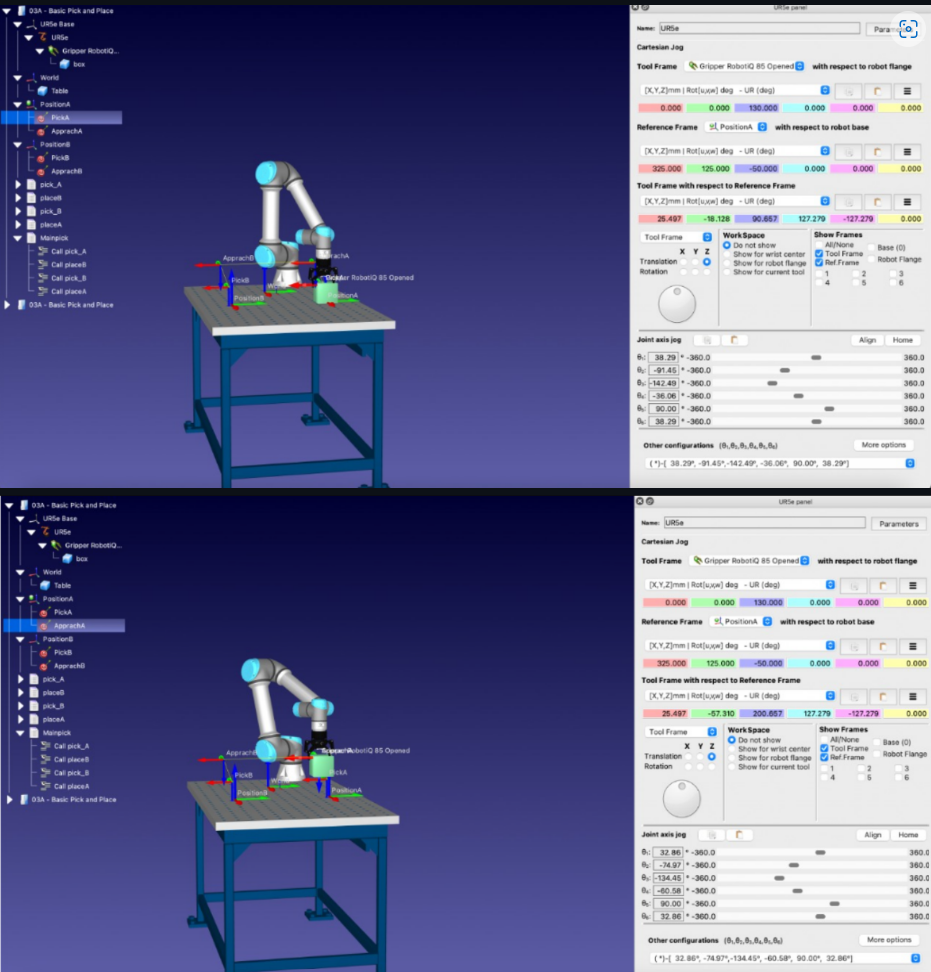
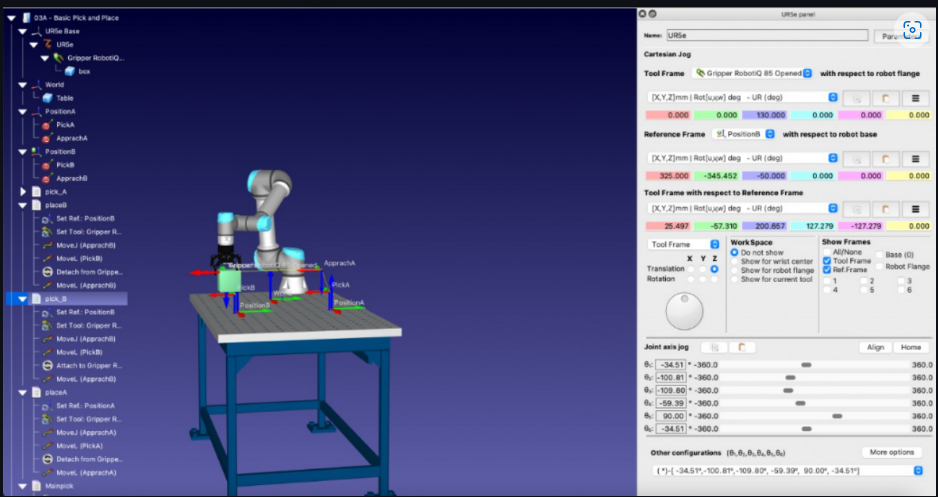

# Experiment-02-Introduction-to-Roboanalyzer-
## AIM: 
To Design & simulate an environment for pick & place operations with Industrial Robot using Robo DK software
### COMPONENTS REQUIRED:
1.	RoboDK

### THEORY: 

 Types of pick and place robots
There are several pick and place robot types and components, including:

Robotic arm – Robotic arms are the most common type of pick and place robots. A 5-axis robotic arm robot can be used for standard pick and place applications where objects are picked up and moved to other locations in a single plane. A 6-axis robotic arm robot is used for more complex applications, such as when objects must be twisted or re-oriented before being placed in another location.
Cartesian – Like a 6-axis robotic arm, Cartesian robots work in multiple planes. These robots move in three orthogonal axes (X, Y and Z) using Cartesian coordinates. They can be constructed with any type of linear actuator and several types of drive mechanisms such as belt, ball or lead screw mechanisms. They typically have better positioning accuracy compared to 6-axis robotic arms.
Delta – Often used in applications where robots pick items in groups and place them in assembly patterns or containers, Delta robots have advanced vision technologies that enable them to distinguish various sizes, shapes and colors. There are several configurations of Delta robots, but most have three arms that operate on four axes. They have heavy motors affixed to a frame, with lightweight arms connected to linking rods with joints at either end of each arm (typically ball joints) to allow movement.
Fast pick – Fast pick robots are ideal for use in medium- and high-volume applications with high-velocity SKUs. Fast pick robots fully automate the picking process, freeing up the human workforce to focus on higher-impact activities. They’re ideal for fast-moving “top-off” items, such as promotional items added to orders or batteries. These robots can pick up to 300 SKUs per hour from a pool of up to 8 SKUs.
Collaborative – Collaborative robots augment the work of humans by leading associates to pick locations and guiding associates through each task. By optimizing routes in real-time and keeping associates on task, collaborative robots help associates work more efficiently.

Applications for pick and place robots
Pick and place robots are often used in manufacturing but are also used in applications such as packaging, bin picking and inspection. Here’s a look at a few of the most common applications for pick and place robots and how they’re used.

Assembly – Pick and place robots used in assembly applications grab incoming parts from one location, such as a conveyor, and place or affix the part on another piece of the item. The two joined parts are then transported to the next assembly area.
Packaging – Pick and place robots used in the packaging process grab items from an incoming source or designated area and place the items in a packaging container.
Bin picking – Pick and place robots used in bin picking applications grab parts or items from bins. These pick and place robots typically have advanced vision systems allowing them to distinguish color, shape and size to pick the right items even from bins containing randomly mixed items. These parts or items are then sent to another location for assembly or packaging.
Inspection – Pick and place robots used for inspection applications are equipped with advanced vision systems to pick up objects, detect anomalies and remove defective parts or items by placing them in a designated location.

### PROCEDURE:
Select a robot New robots can be added from a local drive or from the online library:

Select File Open online library (Ctrl+Shift+O). A new nested window will appear showing the online library It is also possible to select the corresponding button in the toolbar. Use the filters to find your robot by brand, payload, ... In this example, we will use a UR10 robot (10 kg payload robot and 1.3 m reach). Select Download. The robot should automatically appear in the station in a few seconds. The online library can be closed once the robot is loaded Tip: Selecting reset filter in the online library will remove any filter that was use Tip: Alternatively, it is also possible to download the robot files (.robot extension) separately, from the website: http://robodk.com/library and open them in RoboDK by drag & dropping the file to the main window or by selecting FileOpen. Note: Every time a new robot is loaded in RoboDK, a new reference frame is added representing the robot base frame. Note: Loading robots from the online library will store them in the local library. The default location of this folder is: C:/RoboDK/Library/.
	 
	 
	 

### PROGRAM:
~~~
import sys
import os
sys.path.append(os.path.abspath(r"""E:/RoboDK/Posts/""")) # temporarily add path to POSTS folder

from Universal_Robots import *

try:
  from robodk.robomath import PosePP as p
except:
  # This will be removed in future versions of RoboDK
  from robodk import PosePP as p

print('Total instructions: 16')
r = RobotPost(r"""Universal_Robots""",r"""UR5e""",6, axes_type=['R','R','R','R','R','R'], ip_com=r"""127.0.0.1""", api_port=20500, prog_ptr=2236750540464, robot_ptr=2236698204000)

r.ProgStart(r"""Mainpick""")
r.RunMessage(r"""Program generated by RoboDK v5.4.1 for UR5e on 25/06/2022 17:16:10""",True)
r.RunMessage(r"""Using nominal kinematics.""",True)
r.RunCode(r"""pick_A""", True)
r.RunCode(r"""placeB""", True)
r.RunCode(r"""pick_B""", True)
r.RunCode(r"""placeA""", True)
r.ProgFinish(r"""Mainpick""")
r.ProgStart(r"""pick_A""")
r.setFrame(p(325,125,-50,0,0,0),-1,r"""PositionA""")
r.setTool(p(0,0,130,0,0,0),85,r"""Gripper RobotiQ 85 Opened""")
r.MoveJ(p(25.497,-57.3097,200.657,-90,-0.000220614,180),[32.8573,-74.9724,-134.453,-60.575,89.9999,32.8573],[0,1,0])
r.MoveL(p(25.497,-18.128,90.657,-90,-0.000220614,180),[38.2899,-91.4491,-142.494,-36.0575,90,38.2899],[0,1,0])
r.RunMessage(r"""Attach to Gripper RobotiQ 85 Opened""",True)
r.MoveL(p(25.497,-57.3097,200.657,-90,-0.000220614,180),[32.8573,-74.9724,-134.453,-60.575,89.9999,32.8573],[0,1,0])
r.ProgFinish(r"""pick_A""")
r.ProgStart(r"""placeB""")
r.setFrame(p(325,-345.452,-50,0,0,0),-1,r"""PositionB""")
r.MoveJ(p(25.497,-57.3097,200.657,-90,-0.000220614,180),[32.8573,-74.9724,-134.453,-60.575,89.9999,32.8573],[0,1,0])
r.MoveL(p(25.497,-18.128,90.657,-90,-0.000220614,180),[38.2899,-91.4491,-142.494,-36.0575,90,38.2899],[0,1,0])
r.RunMessage(r"""Detach from Gripper RobotiQ 85 Opened""",True)
r.MoveL(p(25.497,-57.3097,200.657,-90,-0.000220614,180),[32.8573,-74.9724,-134.453,-60.575,89.9999,32.8573],[0,1,0])
r.ProgFinish(r"""placeB""")
r.ProgStart(r"""pick_B""")
r.MoveJ(p(25.497,-57.3097,200.657,-90,-0.000220614,180),[32.8573,-74.9724,-134.453,-60.575,89.9999,32.8573],[0,1,0])

raise Exception("""Your license does not allow generating programs with more than 50 lines of code. Upgrade your license to unlock this feature.""")
~~~
 
 
 ### Output:
 
 
 ### RESULTS :  
 An environment for pick & place operations with Industrial Robot has been created and the simulation has been completed successfully using Robo DK software.

